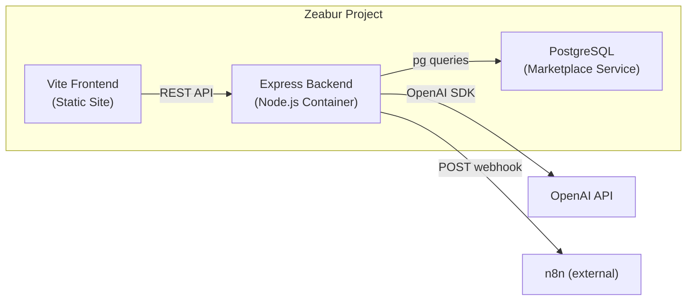

# PostgreSQL Backend + Export System Plan

## Current State

The app is **frontend-only** with no persistence -- all data lives in Zustand stores and is lost on refresh. Sessions are hardcoded defaults. AI features are mocked with `setTimeout`. Export button exists but has no handler. Deployed as a single Vite static site on Zeabur.

## Architecture After This Plan




Frontend talks to the Express backend via REST. Backend owns all data in PostgreSQL and proxies AI calls to OpenAI. No auth (single-user tool).

---

## Phase 1: Express Backend + PostgreSQL Schema

### 1a. Backend project setup

Create `server/` directory at repo root alongside `app/`:

- `server/package.json` -- Express, `pg` (node-postgres), `cors`, `dotenv`, `openai` SDK
- `server/tsconfig.json` -- TypeScript, compiled to `dist/`
- `server/Dockerfile` -- Node 20 Alpine, `npm ci && npm run build`, expose port 3000
- `server/.env.example` -- `DATABASE_URL`, `OPENAI_API_KEY`, `OPENAI_MODEL` (default `gpt-4o-mini`), `N8N_WEBHOOK_URL` (optional)

### 1b. Database schema

Single `sessions` table covering the full PRD data model from [PRD.md](PRD.md) Section 3.1:

```sql
CREATE TABLE sessions (
  id            UUID PRIMARY KEY DEFAULT gen_random_uuid(),
  client        TEXT NOT NULL,
  industry      TEXT NOT NULL,
  phase         TEXT NOT NULL CHECK (phase IN ('requirements','follow-up','demo','troubleshoot')),
  attendees     TEXT DEFAULT '',
  date          DATE NOT NULL DEFAULT CURRENT_DATE,
  time          TIME NOT NULL DEFAULT CURRENT_TIME,
  
  transcript        TEXT DEFAULT '',
  manual_notes      TEXT DEFAULT '',
  quick_tags        JSONB DEFAULT '[]',
  
  structured_notes      TEXT DEFAULT '',
  ai_questions          TEXT DEFAULT '',
  private_solutions     TEXT DEFAULT '',
  ai_solution_feedback  TEXT DEFAULT '',
  
  created_at    TIMESTAMPTZ DEFAULT NOW(),
  updated_at    TIMESTAMPTZ DEFAULT NOW()
);
```

A simple `db/migrate.ts` script that runs on server startup to create the table if not exists.

### 1c. REST API routes

All routes under `/api`:

- **Sessions CRUD**
  - `GET    /api/sessions` -- list all (returns lightweight meta: id, client, industry, phase, date, updated_at)
  - `POST   /api/sessions` -- create (body: client, industry, phase, attendees)
  - `GET    /api/sessions/:id` -- get full session
  - `PATCH  /api/sessions/:id` -- partial update (auto-save from frontend, updates `updated_at`)
  - `DELETE /api/sessions/:id` -- delete
- **AI endpoints** (proxy to OpenAI)
  - `POST /api/ai/structure` -- body: `{ sessionId }`, reads session data, calls OpenAI, saves result
  - `POST /api/ai/questions` -- same pattern
  - `POST /api/ai/domain`    -- body: `{ sessionId, term }`
  - `POST /api/ai/solutions` -- body: `{ sessionId }`
- **Export endpoints**
  - `POST /api/export/webhook` -- body: `{ sessionId }`, POSTs session JSON to configured n8n webhook URL
  - `GET  /api/export/:id/json` -- returns session as JSON download
  - `GET  /api/export/:id/markdown` -- returns session as `.md` download
  - `GET  /api/export/:id/pdf` -- returns session as PDF (using `pdfkit` or `@react-pdf/renderer` on server)

---

## Phase 2: Frontend Refactor -- Connect to Backend

### 2a. API client layer

Create `app/src/lib/api.ts` with typed fetch wrappers for all backend routes. Base URL from `VITE_API_URL` env var (for Zeabur internal networking).

### 2b. Refactor Zustand session store

`[app/src/stores/session.ts](app/src/stores/session.ts)` currently has hardcoded defaults and no persistence. Refactor to:

- Remove `defaultSessions` and `defaultTags`
- `loadSessions()` -- fetches from `GET /api/sessions` on app mount
- `addSession()` -- calls `POST /api/sessions`, then prepends result to local list
- `removeSession()` -- calls `DELETE /api/sessions/:id`, then removes from local list
- `updateSession()` -- calls `PATCH /api/sessions/:id` with 1000ms debounce (auto-save)
- Expand `Session` interface to include all PRD fields (transcript, notes, tags, AI outputs)
- Tags become per-session (stored in `quick_tags` JSONB), not global

### 2c. Wire up screens to use real data

- **Dashboard** -- calls `loadSessions()` on mount, stats computed from real data
- **Setup** -- `addSession()` creates in DB, navigates to session
- **Session tabs** -- `updateSession()` on every content change (debounced), AI tabs call backend AI endpoints
- **Record tab** -- Web Speech API writes transcript into session, auto-saved via `updateSession()`

---

## Phase 3: Export UI

### 3a. Export modal component

Replace the current no-op Download button in `[app/src/screens/Session.tsx](app/src/screens/Session.tsx)` with an "Export" button that opens a glassmorphism modal with export options:

- **Download as Markdown** -- `GET /api/export/:id/markdown` -> browser download
- **Download as JSON** -- `GET /api/export/:id/json` -> browser download  
- **Download as PDF** -- `GET /api/export/:id/pdf` -> browser download
- **Send to n8n** -- `POST /api/export/webhook` -> toast confirmation
- **Export to Notion** -- grayed out with "Coming soon" label (deferred per your request)

Each option is a card with icon, title, and subtitle. Clicking triggers the export and shows a loading state, then success/error toast.

---

## Phase 4: Deployment on Zeabur

### 4a. Zeabur setup (3 services in one project)

1. **PostgreSQL** -- add via Zeabur Marketplace ("Databases" section, one-click). Copy the private connection string.
2. **Backend** -- deploy `server/` from GitHub. Set env vars:
  - `DATABASE_URL` = PostgreSQL private connection string from step 1
  - `OPENAI_API_KEY` = your key
  - `OPENAI_MODEL` = `gpt-4o-mini` (or whichever you prefer)
  - `N8N_WEBHOOK_URL` = your n8n endpoint (optional)
  - `PORT` = 3000
3. **Frontend** -- already deployed. Add env var:
  - `VITE_API_URL` = backend's internal/public URL (Zeabur provides this)

Zeabur handles internal networking between containers within the same project -- the backend can reach PostgreSQL via the private hostname, and the frontend reaches the backend via its public domain or internal URL.

### 4b. Dockerfiles

- `server/Dockerfile` for the backend (Node 20 Alpine, multi-stage build)
- Frontend continues using Zeabur's auto-detected Vite build (no Dockerfile needed, root dir = `/app`)

---

## File Changes Summary

**New files:**

- `server/` -- entire backend directory (package.json, tsconfig, Dockerfile, src/)
- `server/src/index.ts` -- Express app entry
- `server/src/db.ts` -- PostgreSQL pool + migration
- `server/src/routes/sessions.ts` -- CRUD routes
- `server/src/routes/ai.ts` -- OpenAI proxy routes  
- `server/src/routes/export.ts` -- Export routes (JSON, Markdown, PDF, webhook)
- `server/src/prompts.ts` -- System prompts from PRD Section 5
- `app/src/lib/api.ts` -- Frontend API client
- `app/src/components/ui/ExportModal.tsx` -- Export options modal

**Modified files:**

- `[app/src/stores/session.ts](app/src/stores/session.ts)` -- full refactor for API-backed persistence
- `[app/src/screens/Session.tsx](app/src/screens/Session.tsx)` -- export button -> modal trigger
- `[app/src/screens/Dashboard.tsx](app/src/screens/Dashboard.tsx)` -- load sessions from API, real stats
- `[app/src/screens/Setup.tsx](app/src/screens/Setup.tsx)` -- create session via API
- `[app/src/screens/tabs/*.tsx](app/src/screens/tabs/)` -- wire AI calls, auto-save content changes
- `[app/package.json](app/package.json)` -- no new deps needed (fetch is native)
- `[CLAUDE.md](CLAUDE.md)` -- update with backend info

