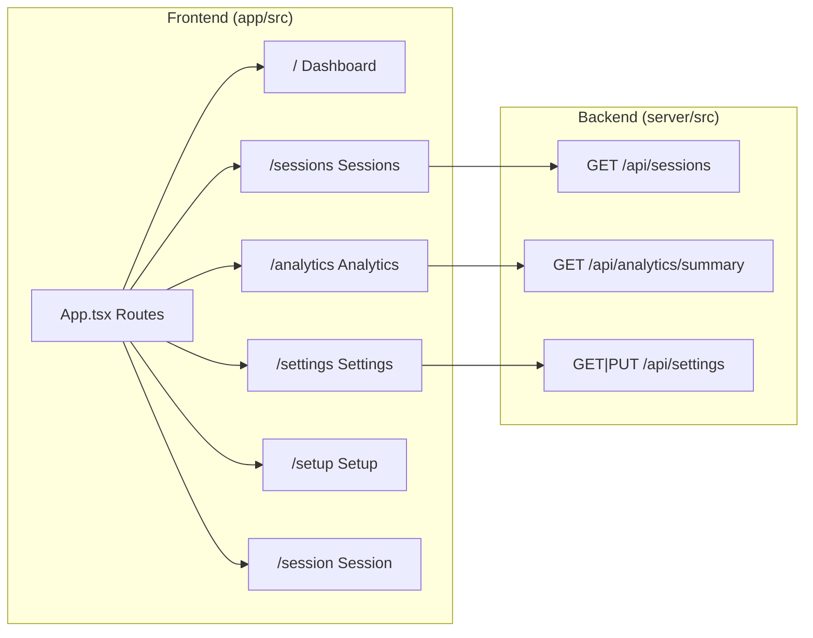

# Sessions Tab + Analytics Tab + Settings Page

## Architecture Overview

---

## Part 1: Sessions Tab (Quant-style)

**Goal:** A data-dense, terminal-meets-Bloomberg view with multiple view modes (table, cards, calendar).

### New files

- `[app/src/screens/Sessions.tsx](app/src/screens/Sessions.tsx)` -- Main sessions list screen with view mode toggles

### Key design

- **Table mode (default):** Sortable columns -- Client, Industry, Phase, Date, Time, Updated. Monospaced data cells (JetBrains Mono). Row hover highlights. Click to open session. Alternating subtle row stripes.
- **Card mode:** Reuse existing card rendering from Dashboard but in a full-width grid.
- **Calendar mode:** Month grid view with session dots colored by phase. Click a day to see sessions.
- Top bar: search, phase filter pills (reuse from Dashboard), view mode toggle (3 icons: table/grid/calendar), sort dropdown.
- Stats ribbon at top: Total sessions, Sessions this week, Most active client, Most common phase -- compact horizontal strip.

### Changes to existing files

- `[app/src/App.tsx](app/src/App.tsx)` -- Add `/sessions` route
- `[app/src/screens/Dashboard.tsx](app/src/screens/Dashboard.tsx)` -- Wire nav tab buttons to `navigate('/sessions')` and `navigate('/analytics')`, track active tab from `location.pathname`

---

## Part 2: Analytics Tab

**Goal:** Full analytics dashboard with 7 visualization types, all using Recharts (best React integration, declarative, composable).

### New dependency

- `recharts` -- installed via `npm install recharts` in `/app`

### New files

- `[app/src/screens/Analytics.tsx](app/src/screens/Analytics.tsx)` -- Analytics dashboard screen
- `[app/src/components/charts/PhaseDonut.tsx](app/src/components/charts/PhaseDonut.tsx)` -- PieChart with phase colors
- `[app/src/components/charts/TimelineBar.tsx](app/src/components/charts/TimelineBar.tsx)` -- BarChart of sessions per week/month
- `[app/src/components/charts/IndustryBreakdown.tsx](app/src/components/charts/IndustryBreakdown.tsx)` -- Horizontal bar chart
- `[app/src/components/charts/ActivityHeatmap.tsx](app/src/components/charts/ActivityHeatmap.tsx)` -- GitHub-style contribution grid (custom SVG, no extra dep)
- `[app/src/components/charts/EngagementFunnel.tsx](app/src/components/charts/EngagementFunnel.tsx)` -- Funnel visualization showing requirements to troubleshoot flow
- `[app/src/components/charts/TagCloud.tsx](app/src/components/charts/TagCloud.tsx)` -- Weighted tag cloud from quickTags
- `[app/src/components/charts/AIUsageStats.tsx](app/src/components/charts/AIUsageStats.tsx)` -- Bar/radar chart showing which AI features are used
- `[app/src/components/charts/IndustryTreemap.tsx](app/src/components/charts/IndustryTreemap.tsx)` -- 2D treemap/mosaic with colored blocks representing industries sized by session count (the "map" visualization)

### Backend support

- `[server/src/routes/analytics.ts](server/src/routes/analytics.ts)` -- New `GET /api/analytics/summary` endpoint that returns pre-aggregated data:
  - `phaseDistribution`: `{ phase, count }[]`
  - `industryDistribution`: `{ industry, count }[]`
  - `sessionsOverTime`: `{ date, count }[]` (grouped by week)
  - `activityHeatmap`: `{ date, count }[]` (daily for past year)
  - `tagDistribution`: `{ label, emoji, count }[]` (aggregated from JSONB)
  - `aiUsage`: `{ feature, count }[]` (count sessions where each AI field is non-empty)
  - `engagementFunnel`: `{ phase, clientCount }[]` (unique clients per phase)
- `[app/src/lib/api.ts](app/src/lib/api.ts)` -- Add `getAnalyticsSummary()` fetch wrapper

### Analytics layout

- Top stats ribbon: Total Sessions, Active Clients, AI Utilization Rate, Avg Tags/Session
- Row 1: Phase Donut (4 cols) | Timeline Bar (8 cols)
- Row 2: Industry Treemap "Map" (6 cols) | Engagement Funnel (6 cols)
- Row 3: Activity Heatmap (full width)
- Row 4: Tag Cloud (4 cols) | Industry Breakdown (4 cols) | AI Usage (4 cols)
- All charts are theme-aware (dark/light) using existing design tokens
- Time range selector: 7d, 30d, 90d, All

---

## Part 3: Settings Page

**Goal:** Centralized configuration page for all user-adjustable settings, persisted in the backend.

### New files

- `[app/src/screens/Settings.tsx](app/src/screens/Settings.tsx)` -- Settings page with collapsible sections
- `[app/src/stores/settings.ts](app/src/stores/settings.ts)` -- Zustand store for settings state

### Backend support

- `[server/src/routes/settings.ts](server/src/routes/settings.ts)` -- `GET /api/settings` and `PUT /api/settings`
- New `settings` table in `[server/src/db.ts](server/src/db.ts)`:
  - `key TEXT PRIMARY KEY, value JSONB, updated_at TIMESTAMPTZ`
  - Settings stored as key-value pairs: `ai_model`, `prompts`, `industries`, `webhook_url`, `theme_default`, `export_defaults`, `speech_settings`

### Settings sections

1. **AI Configuration**
  - Model selector dropdown (gpt-4o, gpt-4o-mini, gpt-4-turbo, etc.)
  - Reads current `OPENAI_MODEL` as default, override stored in DB
2. **System Prompts**
  - 4 expandable text areas: Structure, Questions, Domain, Solutions
  - Each shows the current prompt template with editable content
  - "Reset to Default" button per prompt
  - `[server/src/prompts.ts](server/src/prompts.ts)` updated to check DB overrides before using defaults
3. **Industry List**
  - Drag-reorderable list of industries
  - Add new / remove existing
  - Used by Setup.tsx dropdown (fetched from settings instead of hardcoded)
4. **Webhook Configuration**
  - n8n webhook URL input
  - Test webhook button (sends a test payload)
5. **Theme Preferences**
  - Default theme toggle (dark/light)
  - Persists preference to backend
6. **Export Defaults**
  - Default export format selector
  - Toggle which sections to include in exports
7. **Speech Recognition**
  - Language selector (en-US, en-GB, etc.)
  - Continuous mode toggle

### Settings page design

- Uses the same glassmorphism design system
- Vertical layout with collapsible `GlassCard` sections
- Save button with toast confirmation
- Accessible via gear icon in the nav bar

---

## Routing and Navigation Updates

Current nav in `[app/src/screens/Dashboard.tsx](app/src/screens/Dashboard.tsx)` lines 81-97 has static tab buttons. Changes:

- Extract nav bar into a shared `NavBar` component (`[app/src/components/ui/NavBar.tsx](app/src/components/ui/NavBar.tsx)`) used by Dashboard, Sessions, Analytics
- Add Settings gear icon to nav bar (right side, next to ThemeToggle)
- Active tab determined by `useLocation().pathname`
- Add `/sessions`, `/analytics`, `/settings` routes to `[app/src/App.tsx](app/src/App.tsx)`

---

## File Change Summary

| Action      | File                                                         |
| ----------- | ------------------------------------------------------------ |
| **New**     | `app/src/screens/Sessions.tsx`                               |
| **New**     | `app/src/screens/Analytics.tsx`                              |
| **New**     | `app/src/screens/Settings.tsx`                               |
| **New**     | `app/src/stores/settings.ts`                                 |
| **New**     | `app/src/components/ui/NavBar.tsx`                           |
| **New**     | `app/src/components/charts/` (9 chart components)            |
| **New**     | `server/src/routes/analytics.ts`                             |
| **New**     | `server/src/routes/settings.ts`                              |
| **Edit**    | `app/src/App.tsx` (add routes)                               |
| **Edit**    | `app/src/screens/Dashboard.tsx` (use NavBar)                 |
| **Edit**    | `app/src/screens/Setup.tsx` (read industries from settings)  |
| **Edit**    | `app/src/lib/api.ts` (add analytics + settings endpoints)    |
| **Edit**    | `server/src/index.ts` (mount new routes)                     |
| **Edit**    | `server/src/db.ts` (add settings table migration)            |
| **Edit**    | `server/src/prompts.ts` (check DB overrides)                 |
| **Edit**    | `server/src/routes/ai.ts` (use configurable model + prompts) |
| **Install** | `recharts` in `app/`                                         |

